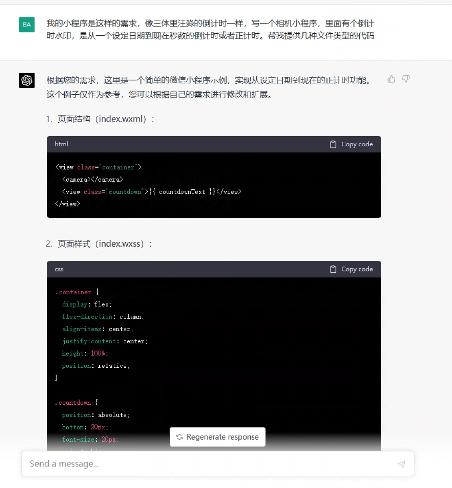

# logoed-camera
这是《三体》系列的二次创作，灵感来自于书中的角色汪淼，他在拍摄每张照片时都看到一个倒计时。这个项目提供了相应的相机实现，可以在每张拍摄的照片上添加倒计时的数字。倒计时日期可以自定义。如果是过去的日子那么会变成正计时。

This is an 二创 of the book series 《三体》, in which 汪淼 sees a countdown of every image he takes with a camera. This provides an implementation of such camera, adding a logo of countdown to every image taken.
# 效果demo
## 原图

## 加水印后

# Special Thanks
To chatgpt for making this possible.
